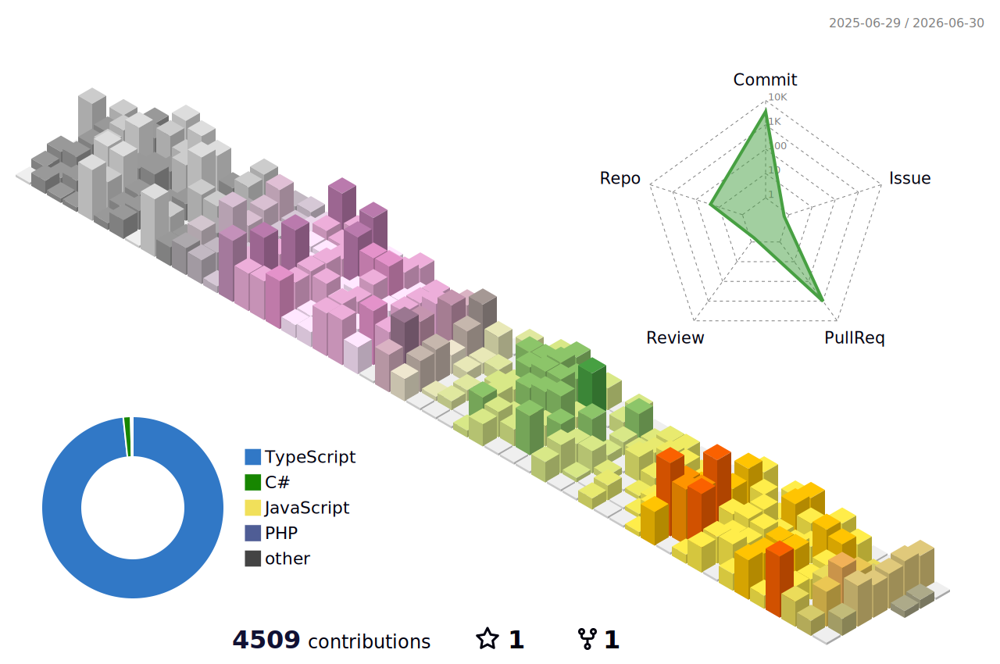

# Hi there 👋, I'm Neal Alim

<div align="center">
  
</div>

<div align="center">
  
[](https://github.com/nealalim26)
[](https://github.com/nealalim26?tab=followers)
[](https://github.com/nealalim26?tab=repositories)

</div>

<!-- Wave Animation -->
<div align="center">
  
</div>

## 🚀 About Me


- 🔭 I'm currently working on innovative web applications
- 🌱 I'm currently learning advanced software architecture patterns
- 👯 I'm looking to collaborate on open source projects
- 💬 Ask me about Full Stack Development, JavaScript, TypeScript, React, Node.js
- 📫 How to reach me: [nealalim26@lebryne.com](mailto:nealalim26@lebryne.com)
- ⚡ Fun fact: I love turning coffee into code!

<!-- Skill Progress Bars -->
## 📊 Skill Levels

<div align="left">

| Skill | Progress | Level |
|-------|----------|-------|
| **Frontend Development** | `████████████████████████████████████████████████████████████████████████████████████████████████` | **90%** |
| **Backend Development** | `█████████████████████████████████████████████████████████████████████████████████████████████` | **85%** |
| **Mobile Development** | `██████████████████████████████████████████████████████████████████████████████████` | **75%** |
| **DevOps & Cloud** | `████████████████████████████████████████████████████████████████████████████` | **70%** |
| **AI/ML Integration** | `██████████████████████████████████████████████████████████████████████` | **65%** |

</div>

<!-- <div align="center">

```
Frontend Development  ████████████████████████████████████████████████████████████████████████████████████████████████ 90%
Backend Development   █████████████████████████████████████████████████████████████████████████████████████████████ 85%
Mobile Development    ██████████████████████████████████████████████████████████████████████████████████ 75%
DevOps & Cloud        ████████████████████████████████████████████████████████████████████████████ 70%
AI/ML Integration     ██████████████████████████████████████████████████████████████████████ 65%
```

</div> -->

## 🛠️ Technologies & Tools

<div align="center">

### 🌸 Frontend Magic


### ⚡ Backend Power


### 📱 Mobile & Cross-Platform


### 💻 Desktop Development


### 🎮 Game Development


### 🔗 Blockchain Development


### 🛠️ DevOps & Tools


</div>

<!-- Animated Code Graphic -->
<div align="center">
  
</div>

## 📊 GitHub Stats

<div align="center">
  
  
</div>

<div align="center">
  
</div>

<!-- GitHub Activity Graph -->
<div align="center">
  
</div>

<!-- GitHub Profile Summary Cards -->
<div align="center">
  
  
  
  
</div>

## 🏆 GitHub Trophies

<div align="center">
  
</div>

<!-- GitHub Metrics Alternative -->
<div align="center">
  
</div>

## 🎵 Currently Listening To

<div align="center">

### 🎧 Currently Playing on Spotify
<!-- [](https://open.spotify.com/user/31iaipcm3ovjuoonauxdqhpkdoia) -->

[](https://open.spotify.com/user/31iaipcm3ovjuoonauxdqhpkdoia)

</div>

<div align="center">

**🎧 Find me on Spotify:** [**@nealalim26**](https://open.spotify.com/user/31iaipcm3ovjuoonauxdqhpkdoia)

[](https://open.spotify.com/user/31iaipcm3ovjuoonauxdqhpkdoia)

</div>

## ⚡ Recent Activity

<!--START_SECTION:waka-->


**🐱 My GitHub Data** 

> 📦 35.7 kB Used in GitHub's Storage 
 > 
> 🏆 846 Contributions in the Year 2026
 > 
> 🚫 Not Opted to Hire
 > 
> 📜 4 Public Repositories 
 > 
> 🔑 24 Private Repositories 
 > 
**I'm an Early 🐤** 

```text
🌞 Morning                4371 commits        ████████░░░░░░░░░░░░░░░░░   31.25 % 
🌆 Daytime                5940 commits        ███████████░░░░░░░░░░░░░░   42.46 % 
🌃 Evening                3554 commits        ██████░░░░░░░░░░░░░░░░░░░   25.41 % 
🌙 Night                  123 commits         ░░░░░░░░░░░░░░░░░░░░░░░░░   00.88 % 
```
📅 **I'm Most Productive on Monday** 

```text
Monday                   2904 commits        █████░░░░░░░░░░░░░░░░░░░░   20.76 % 
Tuesday                  2631 commits        █████░░░░░░░░░░░░░░░░░░░░   18.81 % 
Wednesday                1925 commits        ███░░░░░░░░░░░░░░░░░░░░░░   13.76 % 
Thursday                 2118 commits        ████░░░░░░░░░░░░░░░░░░░░░   15.14 % 
Friday                   2144 commits        ████░░░░░░░░░░░░░░░░░░░░░   15.33 % 
Saturday                 1333 commits        ██░░░░░░░░░░░░░░░░░░░░░░░   09.53 % 
Sunday                   933 commits         ██░░░░░░░░░░░░░░░░░░░░░░░   06.67 % 
```


📊 **This Week I Spent My Time On** 

```text
🕑︎ Time Zone: Asia/Manila

💬 Programming Languages: 
TypeScript               17 hrs 7 mins       ███████████░░░░░░░░░░░░░░   43.89 % 
Other                    13 hrs 58 mins      █████████░░░░░░░░░░░░░░░░   35.83 % 
Markdown                 2 hrs 16 mins       █░░░░░░░░░░░░░░░░░░░░░░░░   05.83 % 
JSON                     2 hrs 11 mins       █░░░░░░░░░░░░░░░░░░░░░░░░   05.64 % 
YAML                     1 hr 28 mins        █░░░░░░░░░░░░░░░░░░░░░░░░   03.77 % 

🔥 Editors: 
Cursor                   27 hrs              █████████████████░░░░░░░░   69.21 % 
VS Code                  6 hrs 44 mins       ████░░░░░░░░░░░░░░░░░░░░░   17.26 % 
Unknown Editor           5 hrs 16 mins       ███░░░░░░░░░░░░░░░░░░░░░░   13.53 % 

🐱‍💻 Projects: 
exam_revise_ui           9 hrs 46 mins       ██████░░░░░░░░░░░░░░░░░░░   25.07 % 
lipadcorp-trd            9 hrs 17 mins       ██████░░░░░░░░░░░░░░░░░░░   23.80 % 
lipadcorp-forms          5 hrs 18 mins       ███░░░░░░░░░░░░░░░░░░░░░░   13.63 % 
lipadcorp-operations     4 hrs 58 mins       ███░░░░░░░░░░░░░░░░░░░░░░   12.76 % 
exam_revise_bo           1 hr 48 mins        █░░░░░░░░░░░░░░░░░░░░░░░░   04.64 % 

💻 Operating System: 
Windows                  34 hrs 18 mins      ██████████████████████░░░   87.95 % 
Mac                      4 hrs 42 mins       ███░░░░░░░░░░░░░░░░░░░░░░   12.05 % 
```

**I Mostly Code in TypeScript** 

```text
TypeScript               47 repos            ████████████████████░░░░░   78.33 % 
JavaScript               6 repos             ██░░░░░░░░░░░░░░░░░░░░░░░   10.00 % 
C#                       5 repos             ██░░░░░░░░░░░░░░░░░░░░░░░   08.33 % 
PHP                      1 repo              ░░░░░░░░░░░░░░░░░░░░░░░░░   01.67 % 
VBA                      1 repo              ░░░░░░░░░░░░░░░░░░░░░░░░░   01.67 % 
```


**Timeline**


 Last Updated on 15/04/2026 00:22:54 UTC
<!--END_SECTION:waka-->

<!-- WakaTime Stats -->
<div align="center">
  
</div>

## 🐍 Contribution Snake

<div align="center">


</div>

## 📈 3D Contribution Calendar

<div align="center">
  


</div>

<!-- Random Dev Quote -->
<!-- <div align="center">
  
</div> -->

<!-- Jokes Card -->
<!-- <div align="center">
  
</div> -->

## 🌐 Connect with Me

<div align="center">

[](https://linkedin.com/in/nealalim26)
[](https://twitter.com/nealalim26)
[](https://instagram.com/nealalim26)
[](mailto:nealalim26@lebryne.com)
[](https://lebryne.com/neal)
[](https://discordapp.com/users/nealalim26)

</div>

<!-- Footer Wave -->
<div align="center">
  
</div>

---

<div align="center">
  <!-- <i>⚡ "The best way to predict the future is to invent it." - Alan Kay</i>
  <br><br>
  
   -->
  <!-- Thanks for visiting -->
  <!-- <br><br> -->
  
</div>
