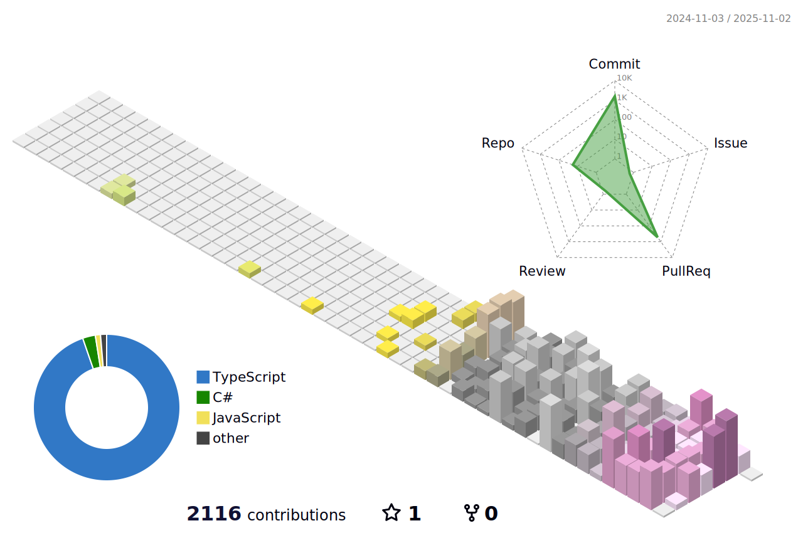

# Hi there 👋, I'm Neal Alim

<div align="center">
  
</div>

<div align="center">
  
[](https://github.com/nealalim26)
[](https://github.com/nealalim26?tab=followers)
[](https://github.com/nealalim26?tab=repositories)
[](https://github.com/nealalim26)
[](https://github.com/nealalim26?tab=repositories)
[](https://github.com/nealalim26)

</div>

<!-- Wave Animation -->
<div align="center">
  
</div>

## 🚀 About Me


- 🔭 I'm currently working on innovative web applications
- 🌱 I'm currently learning advanced software architecture patterns
- 👯 I'm looking to collaborate on open source projects
- 💬 Ask me about Full Stack Development, JavaScript, TypeScript, React, Node.js
- 📫 How to reach me: [nealalim26@gmail.com](mailto:nealalim26@gmail.com)
- ⚡ Fun fact: I love turning coffee into code!

<!-- Skill Progress Bars -->
## 📊 Skill Levels

<div align="left">

| Skill | Progress | Level |
|-------|----------|-------|
| **Frontend Development** | `████████████████████████████████████████████████████████████████████████████████████████████████` | **90%** |
| **Backend Development** | `█████████████████████████████████████████████████████████████████████████████████████████████` | **85%** |
| **Mobile Development** | `██████████████████████████████████████████████████████████████████████████████████` | **75%** |
| **DevOps & Cloud** | `████████████████████████████████████████████████████████████████████████████` | **70%** |
| **AI/ML Integration** | `██████████████████████████████████████████████████████████████████████` | **65%** |

</div>

<!-- <div align="center">

```
Frontend Development  ████████████████████████████████████████████████████████████████████████████████████████████████ 90%
Backend Development   █████████████████████████████████████████████████████████████████████████████████████████████ 85%
Mobile Development    ██████████████████████████████████████████████████████████████████████████████████ 75%
DevOps & Cloud        ████████████████████████████████████████████████████████████████████████████ 70%
AI/ML Integration     ██████████████████████████████████████████████████████████████████████ 65%
```

</div> -->

## 🛠️ Technologies & Tools

<div align="center">

### 🌸 Frontend Magic


### ⚡ Backend Power


### 📱 Mobile & Cross-Platform


### 💻 Desktop Development


### 🎮 Game Development


### 🔗 Blockchain Development


### 🛠️ DevOps & Tools


</div>

<!-- Animated Code Graphic -->
<div align="center">
  
</div>

## 📊 GitHub Stats

<div align="center">
  
  
</div>

<div align="center">
  
</div>

<!-- GitHub Activity Graph -->
<div align="center">
  
</div>

<!-- GitHub Profile Summary Cards -->
<div align="center">
  
  
  
  
</div>

## 🏆 GitHub Trophies

<div align="center">
  
</div>

<!-- GitHub Metrics Alternative -->
<div align="center">
  
</div>

## 🎵 Currently Listening To

<div align="center">

### 🎧 Currently Playing on Spotify
<!-- [](https://open.spotify.com/user/31iaipcm3ovjuoonauxdqhpkdoia) -->

[](https://open.spotify.com/user/31iaipcm3ovjuoonauxdqhpkdoia)

</div>

<div align="center">

**🎧 Find me on Spotify:** [**@nealalim26**](https://open.spotify.com/user/31iaipcm3ovjuoonauxdqhpkdoia)

[](https://open.spotify.com/user/31iaipcm3ovjuoonauxdqhpkdoia)

</div>

## ⚡ Recent Activity

<!--START_SECTION:waka-->


**I'm an Early 🐤** 

```text
🌞 Morning                1143 commits        ████████░░░░░░░░░░░░░░░░░   31.88 % 
🌆 Daytime                1418 commits        ██████████░░░░░░░░░░░░░░░   39.55 % 
🌃 Evening                993 commits         ███████░░░░░░░░░░░░░░░░░░   27.70 % 
🌙 Night                  31 commits          ░░░░░░░░░░░░░░░░░░░░░░░░░   00.86 % 
```
📅 **I'm Most Productive on Monday** 

```text
Monday                   817 commits         ██████░░░░░░░░░░░░░░░░░░░   22.79 % 
Tuesday                  792 commits         ██████░░░░░░░░░░░░░░░░░░░   22.09 % 
Wednesday                441 commits         ███░░░░░░░░░░░░░░░░░░░░░░   12.30 % 
Thursday                 521 commits         ████░░░░░░░░░░░░░░░░░░░░░   14.53 % 
Friday                   433 commits         ███░░░░░░░░░░░░░░░░░░░░░░   12.08 % 
Saturday                 298 commits         ██░░░░░░░░░░░░░░░░░░░░░░░   08.31 % 
Sunday                   283 commits         ██░░░░░░░░░░░░░░░░░░░░░░░   07.89 % 
```


📊 **This Week I Spent My Time On** 

```text
💬 Programming Languages: 
TypeScript               12 hrs 29 mins      ████████████████████░░░░░   79.30 % 
JSON                     1 hr 6 mins         ██░░░░░░░░░░░░░░░░░░░░░░░   07.07 % 
JavaScript               23 mins             █░░░░░░░░░░░░░░░░░░░░░░░░   02.46 % 
CSV                      19 mins             █░░░░░░░░░░░░░░░░░░░░░░░░   02.11 % 
Other                    19 mins             █░░░░░░░░░░░░░░░░░░░░░░░░   02.02 % 

🔥 Editors: 
Cursor                   15 hrs 5 mins       ████████████████████████░   95.78 % 
VS Code                  28 mins             █░░░░░░░░░░░░░░░░░░░░░░░░   03.00 % 
Visual Studio            11 mins             ░░░░░░░░░░░░░░░░░░░░░░░░░   01.22 % 

💻 Operating System: 
Mac                      15 hrs 30 mins      █████████████████████████   98.45 % 
Windows                  14 mins             ░░░░░░░░░░░░░░░░░░░░░░░░░   01.55 % 
```


<!--END_SECTION:waka-->

<!-- WakaTime Stats -->
<div align="center">
  
</div>

## 🐍 Contribution Snake

<div align="center">


</div>

## 📈 3D Contribution Calendar

<div align="center">
  


</div>

<!-- Random Dev Quote -->
<!-- <div align="center">
  
</div> -->

<!-- Jokes Card -->
<!-- <div align="center">
  
</div> -->

## 🌐 Connect with Me

<div align="center">

[](https://linkedin.com/in/nealalim26)
[](https://twitter.com/nealalim26)
[](https://instagram.com/nealalim26)
[](mailto:nealalim26@lebryne.com)
[](https://lebryne.com/neal)
[](https://discordapp.com/users/nealalim26)

</div>

<!-- Footer Wave -->
<div align="center">
  
</div>

---

<div align="center">
  <!-- <i>⚡ "The best way to predict the future is to invent it." - Alan Kay</i>
  <br><br>
  
   -->
  <!-- Thanks for visiting -->
  <!-- <br><br> -->
  
</div>
