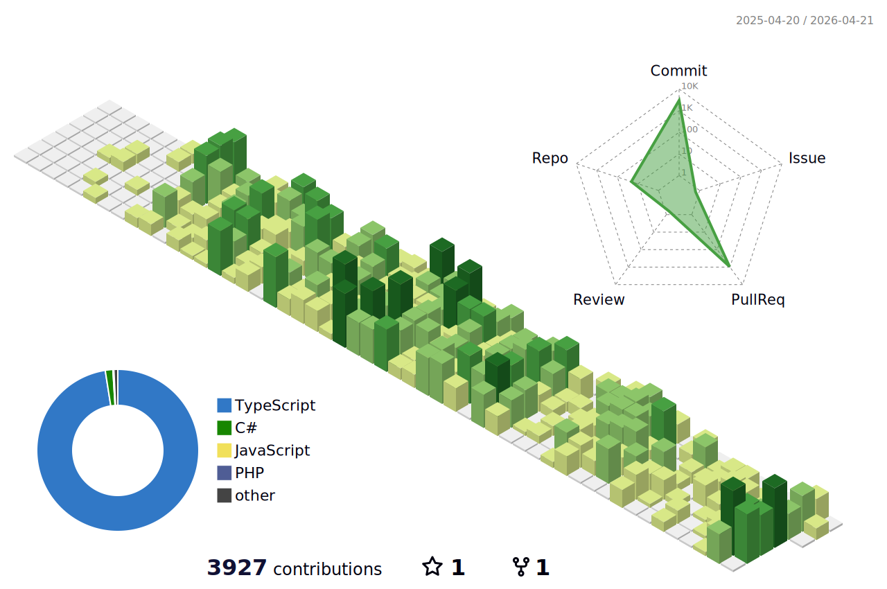

# Hi there 👋, I'm Neal Alim

  

  

## 🚀 About Me

- 🔭 I'm currently working on innovative web applications
- 🌱 I'm currently learning advanced software architecture patterns
- 👯 I'm looking to collaborate on open source projects
- 💬 Ask me about Full Stack Development, JavaScript, TypeScript, React, Node.js
- 📫 How to reach me: [nealalim26@gmail.com](mailto:nealalim26@gmail.com)
- ⚡ Fun fact: I love turning coffee into code!

## 🛠️ Technologies & Tools

### 🌸 Frontend Magic

### ⚡ Backend Power

### 📱 Mobile & Cross-Platform

### 💻 Desktop Development

### 🎮 Game Development

### 🔗 Blockchain Development

### 🛠️ DevOps & Tools

## 📊 GitHub Stats

  
  

  

<!-- Alternative Stats in case main ones don't load -->

📈 Alternative Stats View

 

  

  

## 🏆 GitHub Trophies

  

## ⚡ Recent Activity

<!--START_SECTION:waka-->
<!--END_SECTION:waka-->

## 🐍 Contribution Snake

  

## 📈 3D Contribution Calendar

  

## 🌐 Connect with Me

---

  <i>⚡ "The best way to predict the future is to invent it." - Alan Kay</i>
    
  

